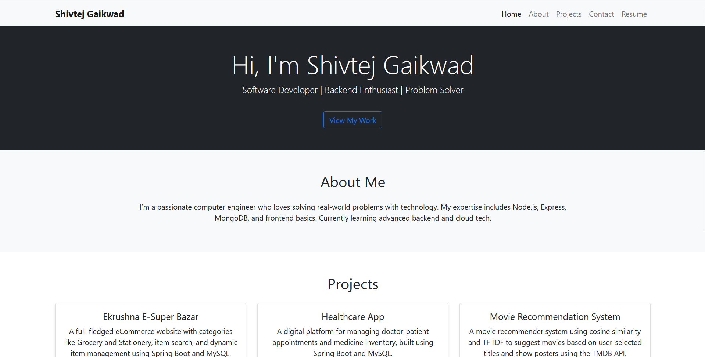
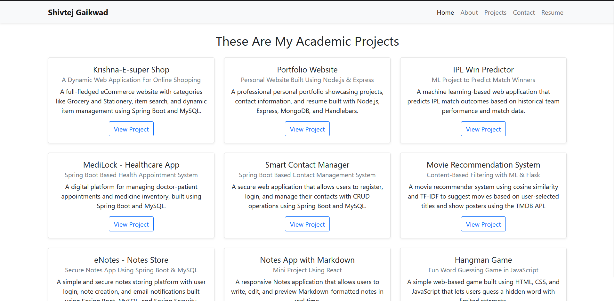
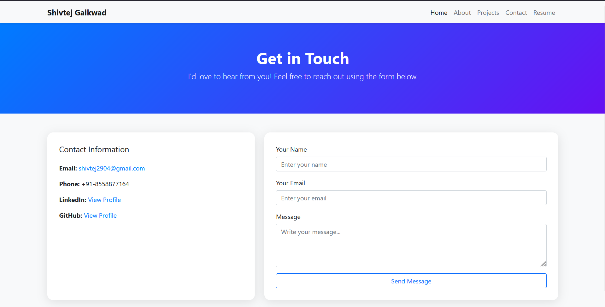
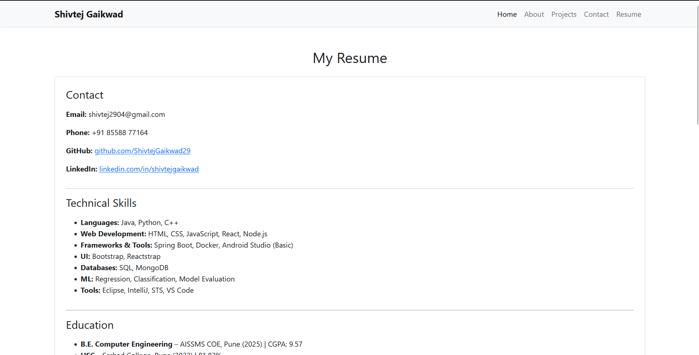

# 💼 Shivtej Gaikwad — Portfolio Website

Welcome to my personal portfolio website built using **Node.js**, **Express**, **MongoDB**, and **Bootstrap**. This project showcases my skills, academic projects, resume, and a contact form that emails messages directly to me.

---

## 🚀 Live Features

- 🏠 Home Page with brief introduction
- 👨‍💻 About Page with skills and story
- 📂 Project Showcase with live GitHub links
- 📧 Contact Form (saves to MongoDB and sends email using Nodemailer)
- 📄 Resume Download
- Responsive layout with Bootstrap

---

## 📸 Website Previews

| Home | Projects | Contact | Resume |
|------|----------|---------|--------|
|  |  |  |  |

---

## 🛠️ Tech Stack

- **Backend:** Node.js, Express.js
- **Frontend:** HTML, Handlebars (HBS), Bootstrap 5
- **Database:** MongoDB (via MongoDB Atlas)
- **Email Service:** Nodemailer + Gmail App Password
- **Deployment:** Railway (Recommended) or any Node.js hosting platform

---

## 📁 Folder Structure

├── public/
│ └── static/css/style.css
├── src/
│ ├── app.js
│ ├── Router/main.js
│ ├── Model/
│ │ ├── Project.js
│ │ └── Contact.js
│ ├── View/
│ │ ├── home.hbs
│ │ ├── project.hbs
│ │ ├── contact.hbs
│ │ ├── resume.hbs
│ │ ├── about.hbs
│ │ └── partials/navbar.hbs
├── images/
│ ├── home.png
│ ├── project.png
│ ├── contact.png
│ └── resume.png
├── .env
├── .gitignore
└── README.md

---

## ⚙️ Setup Instructions

### 1. Clone the Repo
```bash
git clone https://github.com/ShivtejGaikwad29/my-portfolio.git
cd my-portfolio
npm install

